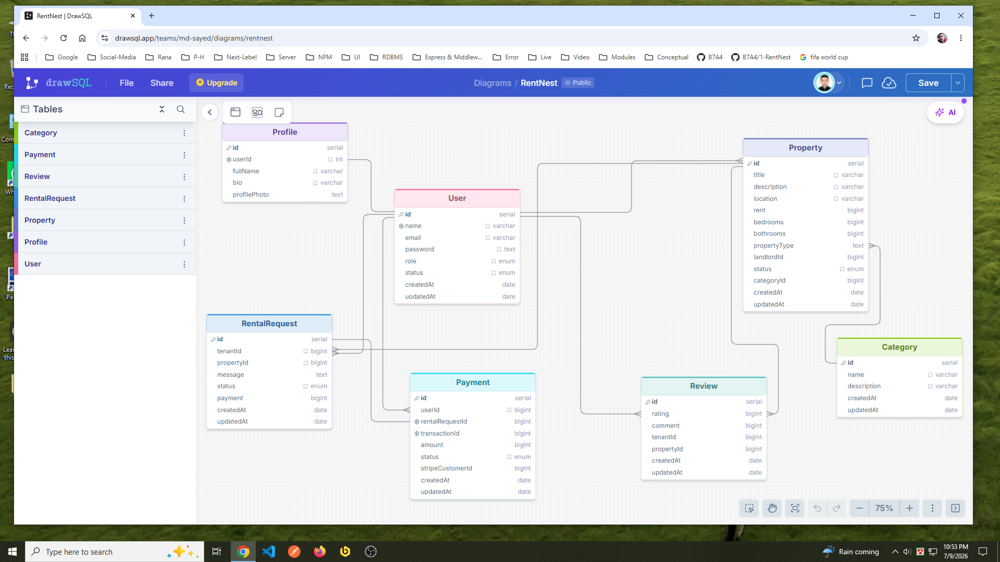

## Project Name: RentNest

## Introduction: 
RentNest is a modern and secure rental property management platform that simplifies the process of renting properties for tenants, landlords, and administrators. It provides a centralized system where landlords can list and manage rental properties, tenants can search for suitable homes, submit rental requests, complete online payments, and leave reviews after their rental experience. Administrators oversee the platform by managing users, property listings, rental requests, and property categories.

The backend is built using Node.js, Express.js, TypeScript, PostgreSQL, and Prisma ORM, following a clean architecture with secure JWT-based authentication and role-based authorization. The API is designed to be scalable, maintainable, and easy to integrate with web or mobile applications.

## Why RentNest? 
Traditional rental processes often involve manual communication, paperwork, and a lack of transparency between landlords and tenants. RentNest addresses these challenges by providing a digital platform where every step—from property discovery to rental approval and payment—is handled efficiently and securely.

## Usefulness of RentNest: 
RentNest offers several practical benefits for all users of the platform:

## 🏠 For Tenants:
1. Easily browse available rental properties.
2. Search and filter properties by location, price, and category.
3. Submit rental requests online.
4. Track the status of rental applications.
5. Make secure online payments through Stripe.
6. View payment history.
7. Share rental experiences by posting reviews.

## 🏘️ For Landlords:
1. Create and manage rental property listings.
2. Update property availability at any time.
3. Review tenant rental requests.
4. Approve or reject requests with a single action.
5. Monitor rental history and tenant feedback.

## 👨‍💼 For Administrators:
1. Manage all users within the system.
2. Ban or activate user accounts when necessary.
3. Monitor all property listings.
4. View all rental requests and payment activities.
5. Manage property categories to keep listings organized.

## 💻 Technical Benefits:
1. Secure JWT-based authentication.
2. Role-based access control for enhanced security.
3. Well-structured RESTful API.
4. PostgreSQL database with Prisma ORM.
5. Scalable and maintainable architecture.
6. Easy integration with frontend web and mobile applications.
7. Online payment integration using Stripe.

## Conclusion: 
RentNest provides a complete backend solution for a modern rental property marketplace. By digitizing property management, rental requests, payments, and reviews, it improves the overall rental experience for tenants and landlords while giving administrators full control over the platform. Its secure architecture, clean code structure, and scalable design make it suitable for both academic projects and real-world rental management applications.

## ERD Relation: 
https://drawsql.app/teams/md-sayed/diagrams/rentnest

## ERD Design: 

  
  

